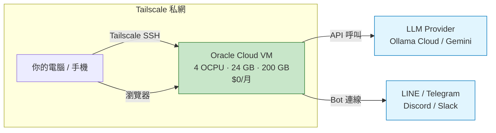

# 免費養龍蝦 — OpenClaw + Oracle Cloud + Ollama/LiteLLM

零成本架設 24/7 個人 AI 助手的完整教學。

## 這是什麼？

[OpenClaw](https://github.com/openclaw/openclaw) 是開源的個人 AI 助手，支援 LINE、Telegram、Discord、Slack 等 20+ 訊息頻道。這個 repo 教你如何用**完全免費**的資源把它跑起來。

| 比喻 | 元件 | 說明 |
|------|------|------|
| 龍蝦 | [OpenClaw](https://github.com/openclaw/openclaw) | 開源個人 AI 助手 |
| 池 | [Oracle Cloud Always Free](https://www.oracle.com/cloud/free/) | ARM VM (4 OCPU / 24 GB / 200 GB)，永久免費 |
| 飼料 | [Ollama Cloud](https://ollama.com) + [LiteLLM](https://github.com/BerriAI/litellm) | 免費模型 API + 統一 LLM gateway |

## 架構

## 教學文件

| # | 文件 | 內容 |
|---|------|------|
| 1 | [建立免費的池子](docs/oracle-cloud-setup.md) | Oracle Cloud ARM VM 建立 + Tailscale 安全連線 |
| 2 | 安裝龍蝦（待撰寫） | OpenClaw 安裝與設定 |
| 3 | [準備飼料](docs/litellm-setup.md) | 免費 LLM 模型 + LiteLLM 統一 gateway |

## 前置需求

- 實體信用卡（Visa / Mastercard / AMEX）— Oracle Cloud 身份驗證用，不會扣款
- [Tailscale](https://tailscale.com) 帳號（免費）
- 約 1-2 小時

## License

[MIT](LICENSE)
