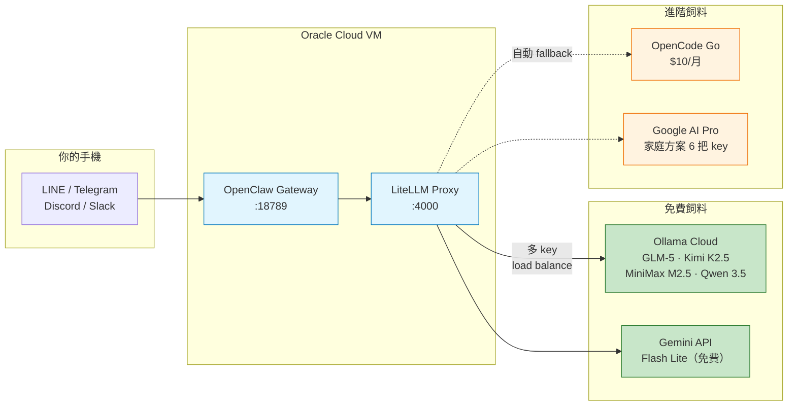
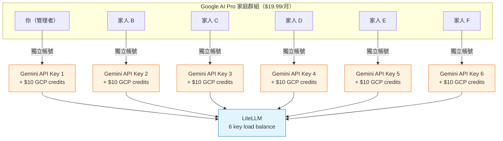

# 準備飼料 — LLM 模型 + LiteLLM

> 龍蝦需要吃飼料。LLM 模型就是 OpenClaw 的飼料 — 免費的飼料到處都有，但單一來源容易斷糧。這篇教你怎麼從多個免費來源取得模型 API，再用 LiteLLM 統一管理，讓龍蝦永遠有東西吃。

## 飼料策略總覽

### 為什麼不只用一家？

每個免費 LLM 供應商都有額度限制 — 一天能用幾次、一小時能問幾題。只靠一家，額度用完就斷糧。

解法：**多個供應商 + 多把 API key + 自動切換**。



### LiteLLM 做了什麼？

| 功能 | 說明 |
|------|------|
| 統一 API 格式 | 不管後面是 Ollama、Gemini 還是 OpenCode，前面都是 OpenAI-compatible API |
| 多 key load balance | 同一個模型配多把 key，LiteLLM 自動輪流分配 |
| 自動 fallback | A 模型掛了，自動切到 B 模型 |
| 一個入口 | OpenClaw 只要指向 `http://localhost:4000`，不用管後面是誰 |

### 成本總覽

| 方案 | 新增費用 | 累計月費 | 你得到什麼 |
|------|---------|---------|-----------|
| **純免費** | $0 | **$0** | Ollama 多帳號 + Gemini Free key，5-6 個模型 |
| + OpenCode Go | +$10 | $10 | + GLM-5/Kimi/MiniMax 穩定通道 |
| + Google AI Pro 家庭 | +$3.33/人 | **~$13.33** | + 6 把 Gemini paid key + $60 GCP credits |

> 本文會先教免費方案，讓你零成本跑起來。進階方案在後半段，花一點小錢就能大幅提升穩定性。

### 前置需求

- 已完成 [建立免費的池子](./oracle-cloud-setup.md)（有 Oracle ARM VM + Tailscale SSH）
- 約 30-60 分鐘

---

## Phase 1：免費飼料（$0）

### Ollama Cloud

[Ollama](https://ollama.com) 原本是在自己電腦跑 LLM 的工具。Ollama Cloud 讓你用他們的雲端 GPU 跑同樣的模型，免費帳號有每小時和每週的額度限制。

#### 可用模型

| 模型 | 參數量 | 特色 | 適合場景 |
|------|--------|------|---------|
| GLM-5 | 744B MoE (40B active) | 智譜 AI 旗艦 | 通用對話、推理 |
| Kimi K2.5 | 1T MoE (32B active) | Moonshot，256K context | 長文分析、coding |
| MiniMax M2.5 | — | 200K context (in+out 合計) | 長文生成 |
| Qwen 3.5 | 397B MoE | 阿里通義 | 中文對話 |
| Gemini 3 Flash | — | Google，透過 Ollama 轉接 | 通用 |

> 模型列表會隨時間變動，以 [ollama.com/cloud](https://ollama.com/cloud) 為準。本文的 config 範例以前四個模型為主；Gemini 3 Flash 透過 Ollama 轉接的設定方式相同，可自行新增。

#### 免費額度

免費帳號的額度描述為「light usage」，有**每小時**和**每週**上限（Ollama 未公開具體數字）。實際體感：一天輕度聊天十幾輪沒問題，但如果讓 AI agent 持續跑任務，很快就會碰到限制。

#### 多帳號策略：突破單帳號限制

每個帳號的額度獨立計算。註冊多個帳號，各自取得 API key，透過 LiteLLM 輪流使用 — 等於把可用額度乘以帳號數量。

**步驟**：

1. 到 [ollama.com](https://ollama.com) 用不同 email 註冊 4 個帳號
2. 每個帳號登入後，到 **Settings** → **API Keys** → **Create API Key**
3. 記下 4 把 API key（後面設定 LiteLLM 時會用到）

```
帳號 A → OLLAMA_KEY_1
帳號 B → OLLAMA_KEY_2
帳號 C → OLLAMA_KEY_3
帳號 D → OLLAMA_KEY_4
```

> 多帳號是合理的使用方式，但請留意各平台的服務條款可能隨時變更。

---

### Gemini API Free Tier

Google 的 Gemini API 有免費層，不需要付費訂閱就能使用部分模型。

#### 免費可用模型

| 模型 | 免費？ | 備註 |
|------|--------|------|
| **Gemini 3.1 Flash Lite** | 是 | Preview，輕量快速 |
| Gemini 3 Flash | **否** | 僅限付費 key |
| Gemini 3.1 Pro | **否** | 僅限付費 key |

#### 申請 API Key

1. 到 [aistudio.google.com/apikey](https://aistudio.google.com/apikey)
2. 用 Google 帳號登入
3. 點 **Create API Key**
4. 記下 key

跟 Ollama 一樣，可以用多個 Google 帳號各自申請 key，透過 LiteLLM load balance。

#### 免費層限制

2025 年 12 月後，Google 將免費層額度砍了 50-80%。以 Gemini 2.5 Flash 為參考（各模型不同）：

- ~10 RPM（每分鐘請求數）
- ~250 RPD（每天請求數）
- ~250,000 TPM（每分鐘 token 數）

> 免費層限制會持續變動，以 [AI Studio Rate Limit 頁面](https://aistudio.google.com/rate-limit) 查看你的帳號實際額度為準。

---

## Phase 2：進階飼料（花一點小錢大幅提升）

> 這部分是選配。純免費方案已經能跑起來，但如果你想要更穩定、更多模型選擇，以下兩個方案性價比很高。

### OpenCode Go（$10/月）

[OpenCode](https://opencode.ai) 是開源的 AI coding agent。它的 **Go** 方案提供三個強力模型的付費 API：

| 模型 | Context | 特色 |
|------|---------|------|
| GLM-5 | 200K in / 128K out | MoE 744B |
| Kimi K2.5 | 256K in / 65K out | MoE 1T |
| MiniMax M2.5 | 200K (in+out 合計) | 超長輸出 |

**價格**：首月 $5，之後 $10/月。200 requests / 5 小時窗口。

這些模型跟 Ollama Cloud 一樣，但走付費通道 — 更穩定、不受免費額度限制。在 LiteLLM 中，我們會用不同的 pool name 區隔免費和付費版本，避免互相影響。

> OpenCode 本身也是很好用的 coding agent，類似 Claude Code。不過本文重點是它的 model API 服務。

---

### Google AI Pro 家庭方案策略

這是本文的亮點策略。善用 Google 的家庭共享機制，用很低的成本取得大量 Gemini API 資源。

#### 核心概念



#### 算數

| 項目 | 金額 |
|------|------|
| Google AI Pro 月費 | $19.99 |
| 家庭成員（含你） | 6 人 |
| 人均分攤 | ~$3.33/月 |
| 每人 GCP credits | $10/月（已實測驗證） |
| GCP credits 總額 | **$60/月** |
| 淨效益 | +$40/月（credits 遠超月費） |

#### 你拿到什麼

- **6 把 Gemini API key** → 透過 LiteLLM load balance，大幅提升可用額度
- **付費模型存取** → Gemini 3 Flash、Gemini 3.1 Pro（免費 key 用不了的模型）
- **$60/月 GCP credits** → 可用於 Vertex AI、Cloud Run 等 Google Cloud 服務

#### 設定步驟

1. **購買 Google AI Pro**：到 [one.google.com](https://one.google.com/about/google-ai-plans/) 訂閱（$19.99/月）
2. **啟用家庭共享**：Google One 設定 → 家庭共享 → 開啟
3. **邀請家人**：最多邀請 5 位家人加入（18 歲以上，各自有 Google 帳號）
4. **各自申請 Gemini API key**：每位成員到 [aistudio.google.com/apikey](https://aistudio.google.com/apikey) 建立 key
5. **各自領取 GCP credits**：每位成員到 [developers.google.com/program](https://developers.google.com/program) 領取 Google Developer Program (GDP) Premium → $10/月 GCP credits
6. **收集 6 把 key**：匯集到 LiteLLM config

> **重要**：GCP credits 需要每位成員**主動**到 Google Developer Program 頁面領取，不會自動發放。不領就浪費了。

---

### 成本彙總

| 組合 | 新增費用 | 累計月費 | 模型數 | 穩定度 | 適合 |
|------|---------|---------|--------|--------|------|
| **純免費** | $0 | **$0** | 5-6 | 中 | 試玩、輕度聊天 |
| + OpenCode Go | +$10 | $10 | 8-9 | 高 | 日常使用 |
| + Google AI Pro 家庭 | +$3.33/人 | **~$13.33** | 10+ | 很高 | 重度使用、AI agent |

---

## Phase 3：安裝 LiteLLM

> 以下步驟皆在 Oracle VM 上執行（透過 Tailscale SSH 連入）。

```bash
ssh ubuntu@oracle-openclaw
```

### Step 1：安裝 LiteLLM

```bash
# 安裝 uv（Python 套件管理器）
curl -LsSf https://astral.sh/uv/install.sh | sh
source ~/.bashrc

# 安裝 LiteLLM（不需要 PostgreSQL）
uv tool install 'litellm[proxy]'

# 確認安裝成功
litellm --version
```

### Step 2：建立設定目錄

```bash
mkdir -p ~/.config/litellm
```

### Step 3：建立 .env（API Keys）

```bash
cat > ~/.config/litellm/.env << 'EOF'
# ============================================================
# Ollama Cloud — 多帳號 key
# ============================================================
OLLAMA_KEY_1=<你的 Ollama 帳號 A 的 API key>
OLLAMA_KEY_2=<你的 Ollama 帳號 B 的 API key>
OLLAMA_KEY_3=<你的 Ollama 帳號 C 的 API key>
OLLAMA_KEY_4=<你的 Ollama 帳號 D 的 API key>

# ============================================================
# Gemini API — 免費 key（多個 Google 帳號各自申請）
# ============================================================
GEMINI_FREE_KEY_1=<Google 帳號 1 的 Gemini API key>
GEMINI_FREE_KEY_2=<Google 帳號 2 的 Gemini API key>
GEMINI_FREE_KEY_3=<Google 帳號 3 的 Gemini API key>

# ============================================================
# [進階] Gemini API — 付費 key（Google AI Pro 家庭成員）
# ============================================================
# GEMINI_PAID_KEY_1=<家庭成員 1 的 Gemini API key>
# GEMINI_PAID_KEY_2=<家庭成員 2 的 Gemini API key>
# GEMINI_PAID_KEY_3=<家庭成員 3 的 Gemini API key>
# GEMINI_PAID_KEY_4=<家庭成員 4 的 Gemini API key>
# GEMINI_PAID_KEY_5=<家庭成員 5 的 Gemini API key>
# GEMINI_PAID_KEY_6=<家庭成員 6 的 Gemini API key>

# ============================================================
# [進階] OpenCode Go
# ============================================================
# OPENCODE_GO_API_KEY=<你的 OpenCode Go API key>
EOF

# 保護 API key 檔案
chmod 600 ~/.config/litellm/.env
```

### Step 4：寫 config.yaml

這是 LiteLLM 的核心設定。重點概念：

- **同一個 `model_name` 配多個 deployment** = LiteLLM 自動在這些 key 之間做 load balance
- **`simple-shuffle`** = 隨機選一把 key 發送請求
- **`fallbacks`** = 某個模型全部 key 都失敗時，自動切換到另一個模型

```bash
cat > ~/.config/litellm/config.yaml << 'YAML'
# ============================================================
# LiteLLM Proxy — 統一 LLM Gateway
# ============================================================

model_list:
  # ============================================================
  # Ollama Cloud — GLM-5（4 把 key 做 load balance）
  # ============================================================
  #
  # ⚠️ 重要：Ollama Cloud 必須用 ollama_chat/* 格式！
  #    不要用 openai/* + ollama.com/v1，否則 stream 時
  #    reasoning_content 不會輸出。
  #
  - model_name: glm-5
    litellm_params:
      model: ollama_chat/glm-5
      api_base: https://ollama.com
      api_key: os.environ/OLLAMA_KEY_1
    model_info:
      id: ollama-glm5-key1
  - model_name: glm-5
    litellm_params:
      model: ollama_chat/glm-5
      api_base: https://ollama.com
      api_key: os.environ/OLLAMA_KEY_2
    model_info:
      id: ollama-glm5-key2
  - model_name: glm-5
    litellm_params:
      model: ollama_chat/glm-5
      api_base: https://ollama.com
      api_key: os.environ/OLLAMA_KEY_3
    model_info:
      id: ollama-glm5-key3
  - model_name: glm-5
    litellm_params:
      model: ollama_chat/glm-5
      api_base: https://ollama.com
      api_key: os.environ/OLLAMA_KEY_4
    model_info:
      id: ollama-glm5-key4

  # ============================================================
  # Ollama Cloud — Kimi K2.5
  # ============================================================
  - model_name: kimi-k2.5
    litellm_params:
      model: ollama_chat/kimi-k2.5
      api_base: https://ollama.com
      api_key: os.environ/OLLAMA_KEY_1
    model_info:
      id: ollama-kimi-key1
  - model_name: kimi-k2.5
    litellm_params:
      model: ollama_chat/kimi-k2.5
      api_base: https://ollama.com
      api_key: os.environ/OLLAMA_KEY_2
    model_info:
      id: ollama-kimi-key2
  - model_name: kimi-k2.5
    litellm_params:
      model: ollama_chat/kimi-k2.5
      api_base: https://ollama.com
      api_key: os.environ/OLLAMA_KEY_3
    model_info:
      id: ollama-kimi-key3
  - model_name: kimi-k2.5
    litellm_params:
      model: ollama_chat/kimi-k2.5
      api_base: https://ollama.com
      api_key: os.environ/OLLAMA_KEY_4
    model_info:
      id: ollama-kimi-key4

  # ============================================================
  # Ollama Cloud — MiniMax M2.5
  # ============================================================
  - model_name: minimax-m2.5
    litellm_params:
      model: ollama_chat/minimax-m2.5
      api_base: https://ollama.com
      api_key: os.environ/OLLAMA_KEY_1
    model_info:
      id: ollama-minimax-key1
  - model_name: minimax-m2.5
    litellm_params:
      model: ollama_chat/minimax-m2.5
      api_base: https://ollama.com
      api_key: os.environ/OLLAMA_KEY_2
    model_info:
      id: ollama-minimax-key2
  - model_name: minimax-m2.5
    litellm_params:
      model: ollama_chat/minimax-m2.5
      api_base: https://ollama.com
      api_key: os.environ/OLLAMA_KEY_3
    model_info:
      id: ollama-minimax-key3
  - model_name: minimax-m2.5
    litellm_params:
      model: ollama_chat/minimax-m2.5
      api_base: https://ollama.com
      api_key: os.environ/OLLAMA_KEY_4
    model_info:
      id: ollama-minimax-key4

  # ============================================================
  # Ollama Cloud — Qwen 3.5
  # ============================================================
  - model_name: qwen3.5
    litellm_params:
      model: ollama_chat/qwen3.5:397b
      api_base: https://ollama.com
      api_key: os.environ/OLLAMA_KEY_1
    model_info:
      id: ollama-qwen35-key1
  - model_name: qwen3.5
    litellm_params:
      model: ollama_chat/qwen3.5:397b
      api_base: https://ollama.com
      api_key: os.environ/OLLAMA_KEY_2
    model_info:
      id: ollama-qwen35-key2
  - model_name: qwen3.5
    litellm_params:
      model: ollama_chat/qwen3.5:397b
      api_base: https://ollama.com
      api_key: os.environ/OLLAMA_KEY_3
    model_info:
      id: ollama-qwen35-key3
  - model_name: qwen3.5
    litellm_params:
      model: ollama_chat/qwen3.5:397b
      api_base: https://ollama.com
      api_key: os.environ/OLLAMA_KEY_4
    model_info:
      id: ollama-qwen35-key4

  # ============================================================
  # Gemini API — Flash Lite（免費 key）
  # ============================================================
  - model_name: gemini-flash-lite
    litellm_params:
      model: gemini/gemini-3.1-flash-lite-preview
      api_key: os.environ/GEMINI_FREE_KEY_1
    model_info:
      id: gemini-flash-lite-free1
  - model_name: gemini-flash-lite
    litellm_params:
      model: gemini/gemini-3.1-flash-lite-preview
      api_key: os.environ/GEMINI_FREE_KEY_2
    model_info:
      id: gemini-flash-lite-free2
  - model_name: gemini-flash-lite
    litellm_params:
      model: gemini/gemini-3.1-flash-lite-preview
      api_key: os.environ/GEMINI_FREE_KEY_3
    model_info:
      id: gemini-flash-lite-free3

  # ============================================================
  # [進階] Gemini API — Flash + Pro（付費 key，Google AI Pro 家庭成員）
  # 取消下方註解即可啟用
  # ============================================================

  # - model_name: gemini-flash
  #   litellm_params:
  #     model: gemini/gemini-3-flash-preview
  #     api_key: os.environ/GEMINI_PAID_KEY_1
  #   model_info:
  #     id: gemini-flash-paid1
  # - model_name: gemini-flash
  #   litellm_params:
  #     model: gemini/gemini-3-flash-preview
  #     api_key: os.environ/GEMINI_PAID_KEY_2
  #   model_info:
  #     id: gemini-flash-paid2
  # （以此類推，最多 6 把 key）

  # - model_name: gemini-pro
  #   litellm_params:
  #     model: gemini/gemini-3.1-pro-preview
  #     api_key: os.environ/GEMINI_PAID_KEY_1
  #   model_info:
  #     id: gemini-pro-paid1
  # （以此類推）

  # ============================================================
  # [進階] OpenCode Go — GLM-5, Kimi K2.5, MiniMax M2.5（$10/月）
  # 取消下方註解即可啟用
  # ============================================================

  # - model_name: glm-5-go
  #   litellm_params:
  #     model: openai/glm-5
  #     api_base: https://opencode.ai/zen/go/v1
  #     api_key: os.environ/OPENCODE_GO_API_KEY
  #   model_info:
  #     id: og-glm5
  #     max_input_tokens: 200000
  #     max_output_tokens: 128000

  # - model_name: kimi-k2.5-go
  #   litellm_params:
  #     model: openai/kimi-k2.5
  #     api_base: https://opencode.ai/zen/go/v1
  #     api_key: os.environ/OPENCODE_GO_API_KEY
  #   model_info:
  #     id: og-kimi-k2.5
  #     max_input_tokens: 256000
  #     max_output_tokens: 65536

  # - model_name: minimax-m2.5-go
  #   litellm_params:
  #     model: anthropic/minimax-m2.5
  #     api_base: https://opencode.ai/zen/go/v1
  #     api_key: os.environ/OPENCODE_GO_API_KEY
  #   model_info:
  #     id: og-minimax-m2.5
  #     max_input_tokens: 200000
  #     max_output_tokens: 200000

# ============================================================
# Router 設定
# ============================================================
router_settings:
  routing_strategy: simple-shuffle
  allowed_fails: 3
  cooldown_time: 60
  num_retries: 2
  timeout: 120
  fallbacks:
    # Ollama Cloud 模型互相 fallback
    - {"glm-5": ["kimi-k2.5", "minimax-m2.5", "gemini-flash-lite"]}
    - {"kimi-k2.5": ["glm-5", "minimax-m2.5", "gemini-flash-lite"]}
    - {"minimax-m2.5": ["glm-5", "kimi-k2.5", "gemini-flash-lite"]}
    - {"qwen3.5": ["glm-5", "kimi-k2.5", "gemini-flash-lite"]}
    # Gemini fallback
    - {"gemini-flash-lite": ["glm-5", "kimi-k2.5"]}
    # [進階] 取消註解以啟用付費 fallback
    # - {"glm-5-go": ["kimi-k2.5-go", "minimax-m2.5-go", "gemini-flash"]}
    # - {"gemini-flash": ["gemini-pro", "glm-5"]}

# ============================================================
# LiteLLM 全域設定
# ============================================================
litellm_settings:
  drop_params: true
  set_verbose: false
  request_timeout: 120
  num_retries: 2

general_settings:
  # ⚠️ 不要開啟 background_health_checks！
  # 它會對每個 deployment 發真實請求，燒光 Ollama 免費配額。
  background_health_checks: false
YAML
```

> **解讀這份 config**：
> - `glm-5` 有 4 個 deployment（4 把 Ollama key）→ LiteLLM 隨機選一把發送
> - `kimi-k2.5`、`minimax-m2.5`、`qwen3.5` 同理
> - `gemini-flash-lite` 有 3 個 deployment（3 把 Gemini free key）
> - 任何一個模型全部 key 都失敗 → 自動 fallback 到清單中的下一個
> - 進階的付費 pool 預設是註解掉的，訂閱後取消註解即可

### Step 5：啟動測試

```bash
# 載入 API keys
source ~/.config/litellm/.env

# 前景啟動（先測試）
litellm --config ~/.config/litellm/config.yaml --port 4000
```

開另一個 SSH 連線測試：

```bash
# 健康檢查
curl -s http://localhost:4000/health/readiness
# → {"status": "healthy"}

# 列出所有可用模型
curl -s http://localhost:4000/models | python3 -c "
import sys, json
for m in json.load(sys.stdin)['data']:
    print(m['id'])
" | sort

# 發一則測試訊息
curl -s http://localhost:4000/chat/completions \
  -H "Content-Type: application/json" \
  -d '{
    "model": "glm-5",
    "messages": [{"role": "user", "content": "用一句話介紹你自己"}]
  }' | python3 -c "
import sys, json
r = json.load(sys.stdin)
print(r['choices'][0]['message']['content'])
"
```

確認收到回覆後，按 `Ctrl+C` 停止前景程序。

### Step 6：設為 systemd 服務（開機自啟）

```bash
# 建立啟動腳本
cat > ~/.config/litellm/start.sh << 'BASH'
#!/bin/bash
set -euo pipefail
source ~/.config/litellm/.env
exec litellm --config ~/.config/litellm/config.yaml --port 4000
BASH
chmod +x ~/.config/litellm/start.sh

# 建立 systemd service
sudo tee /etc/systemd/system/litellm.service << EOF
[Unit]
Description=LiteLLM Proxy
After=network.target

[Service]
Type=simple
User=$USER
ExecStart=/home/$USER/.config/litellm/start.sh
Restart=always
RestartSec=5
Environment=HOME=/home/$USER
WorkingDirectory=/home/$USER/.config/litellm

[Install]
WantedBy=multi-user.target
EOF

# 啟動並設為開機自啟
sudo systemctl daemon-reload
sudo systemctl enable litellm
sudo systemctl start litellm

# 確認狀態
sudo systemctl status litellm
curl -s http://localhost:4000/health/readiness
```

### 驗證清單

- [ ] `curl http://localhost:4000/health/readiness` 回 `{"status": "healthy"}`
- [ ] `curl http://localhost:4000/models` 列出所有模型 pool
- [ ] 對每個模型發一則測試訊息，確認回覆正常
- [ ] `sudo systemctl status litellm` 顯示 active (running)
- [ ] 重開機後 `curl http://localhost:4000/health/readiness` 仍然正常

---

## Phase 4：接上 OpenClaw

> 本段假設你已完成 [安裝龍蝦（OpenClaw）](./openclaw-install.md)。如果尚未安裝，請先完成該教學再回來。

### 設定 OpenClaw 使用 LiteLLM

OpenClaw 支援多種 model provider。將它指向本機的 LiteLLM Proxy，就能透過統一入口存取所有模型。

```bash
# 新增 LiteLLM 作為 model provider
openclaw models auth

# 選擇 provider 類型時，選 OpenAI-compatible
# API Base URL: http://localhost:4000
# API Key: 任意值（LiteLLM 本機免認證）

# 設定預設模型
openclaw models set litellm/glm-5

# 設定 fallback（可選）
openclaw models fallbacks add litellm/kimi-k2.5
openclaw models fallbacks add litellm/minimax-m2.5

# 重啟 gateway 讓設定生效
openclaw gateway restart
```

### 端到端驗證

1. 從手機打開 LINE / Telegram / Discord（你已設定的頻道）
2. 發一則訊息給 OpenClaw
3. 確認收到 AI 回覆
4. 用 `/status` 指令查看目前使用的模型

### 驗證清單

- [ ] 從手機發訊息，收到 AI 回覆
- [ ] `/status` 顯示正確的模型名稱
- [ ] `openclaw gateway usage-cost --days 1` 可看到 token 消耗

---

## 已知陷阱一覽

| # | 陷阱 | 後果 | 避免方式 |
|---|------|------|---------|
| 1 | Ollama Cloud 用 `openai/*` 格式 | stream 時 `reasoning_content` 不輸出 | 必須用 `ollama_chat/*` 格式 |
| 2 | 免費/付費 key 混在同一個 pool | 免費額度限制拖慢付費請求 | 用不同 `model_name` 隔離（如 `glm-5` vs `glm-5-go`） |
| 3 | 開啟 LiteLLM `background_health_checks` | 每 5 分鐘對每個 deployment 發真實請求，燒光 Ollama 週配額 | `config.yaml` 設 `background_health_checks: false` |
| 4 | Gemini 免費層 RPD 限制嚴格 | 一天幾十次就用完 | 多 key load balance + fallback 到 Ollama |
| 5 | Google AI Pro GCP credits 需主動領取 | 不領就浪費 $10/月 | 每位家庭成員到 [developers.google.com/program](https://developers.google.com/program) 領取 |
| 6 | Ollama Cloud 週配額用盡 | 整週無法使用 | 多帳號分散 + fallback 到 Gemini |

---

## 下一步

飼料準備好了，接下來要：

- [安裝龍蝦（OpenClaw）](./openclaw-install.md)（待撰寫）

三步都完成後，你就有了一隻養在免費池子裡、吃免費飼料的龍蝦 — 一個零成本（或幾乎零成本）的個人 AI 助手。

---

## 參考資料

- [Ollama Cloud](https://ollama.com/cloud)
- [Ollama Pricing](https://ollama.com/pricing)
- [Gemini API Pricing](https://ai.google.dev/gemini-api/docs/pricing)
- [Gemini API Rate Limits](https://ai.google.dev/gemini-api/docs/rate-limits)
- [OpenCode Go](https://opencode.ai/go)
- [Google AI Pro Plans](https://one.google.com/about/google-ai-plans/)
- [Google Developer Program](https://developers.google.com/program)
- [LiteLLM Documentation](https://docs.litellm.ai/)
