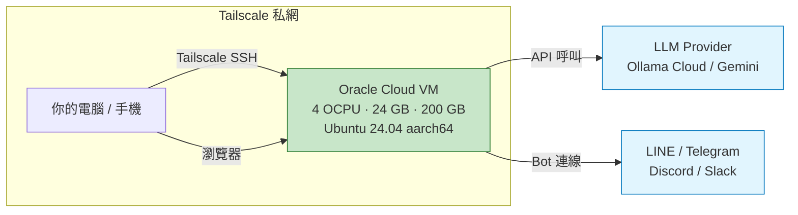
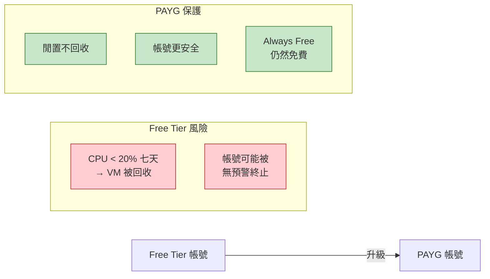
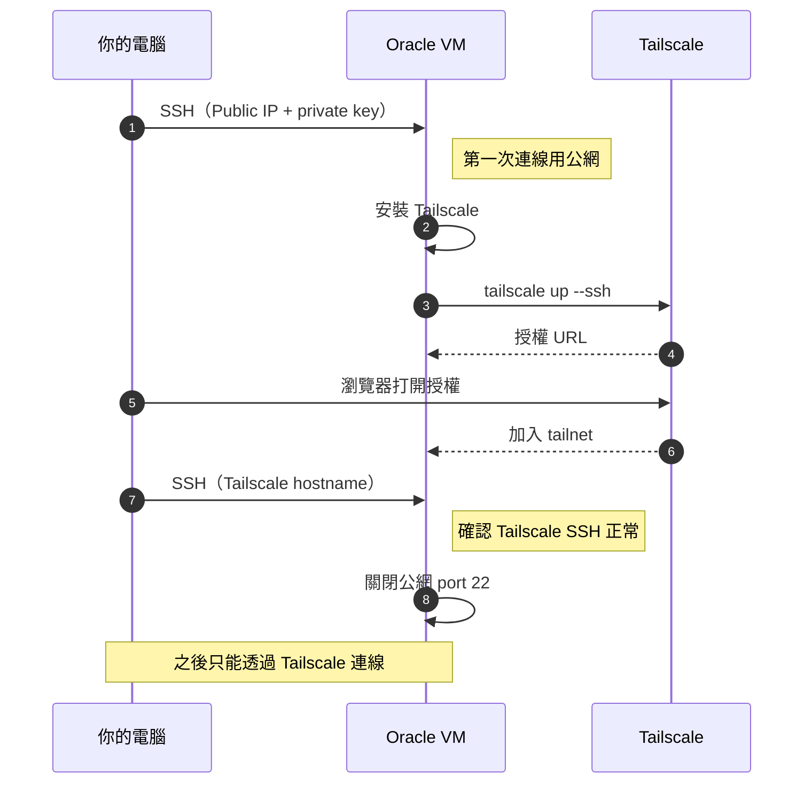

# 建立免費的池子 — Oracle Cloud ARM VM

> 養龍蝦需要一個池子。Oracle Cloud 提供永久免費的 ARM 虛擬機，規格是 4 OCPU + 24 GB RAM + 200 GB 儲存空間，足以 24 小時跑 OpenClaw。

## 為什麼選 Oracle Cloud？

| 方案 | 月費 | 24/7 運行 | 冷啟動 |
|------|------|----------|--------|
| **Oracle Cloud Free Tier** | **$0** | **是** | **無** |
| Cloudflare Moltworker | ~$28 | 是 | 無 |
| Cloudflare + Sleep 10m | ~$5-7 | 否 | 30s-1min+ |
| Hetzner VPS | ~$4.5 | 是 | 無 |
| 自家 Mac Mini | $0（電費） | 是 | 無 |

在雲端方案中，Oracle 是少數能做到「零成本 + 24/7 + 無冷啟動」的選項。如果你家有 Mac Mini 全天開機，那也是好選擇。

### 你會得到什麼

| 資源 | 規格 | 費用 |
|------|------|------|
| CPU | 4 OCPU (Ampere A1, ARM 架構) | $0 |
| 記憶體 | 24 GB | $0 |
| 儲存空間 | 200 GB（帳號級合計額度） | $0 |
| 作業系統 | Ubuntu 24.04 (aarch64) | $0 |
| 網路 | 10 TB/月 outbound | $0 |

### 架構總覽



### 前置需求

- 實體信用卡（Visa / Mastercard / AMEX），不接受虛擬卡、預付卡
- [Tailscale](https://tailscale.com) 帳號（免費方案即可）
- 約 30-60 分鐘

---

## Phase 1：建立 Oracle Cloud 帳號

### Step 1：註冊

前往 https://www.oracle.com/cloud/free/ ，點 **Start for free**。

填寫基本資料後，來到最關鍵的一步：

> **Home Region 一旦選定，永久不可更改。**

| Region | 從台灣的延遲 | ARM 容量 | 建議 |
|--------|-------------|---------|------|
| Tokyo (ap-tokyo-1) | ~37ms | 幾乎搶不到 | 不推薦 |
| Osaka (ap-osaka-1) | ~50ms | 偶爾有 | 可碰運氣 |
| **Singapore (ap-singapore-1)** | **~80ms** | **相對容易** | **推薦** |
| Sydney (ap-sydney-1) | ~120ms | 容易 | 備選 |

**建議選 Singapore**。延遲 80ms 對聊天機器人完全夠用，ARM 容量也充裕。Tokyo 延遲最低但機器幾乎搶不到。

### Step 2：提供信用卡

Oracle 會驗證扣款約 $1 後自動退款，僅用於身份驗證。Always Free 資源不會產生任何費用。

### Step 3：升級為 PAYG（必做）

登入 OCI Console 後，點右上角橘色 **Upgrade** banner → **Upgrade your account**。



> Always Free 資源升級後**仍然免費**，只有超出免費額度的部分才會被收費。Oracle 的 idle compute reclamation 只針對未升級的 Free Tier 帳號，升級 PAYG 後這條規則不適用。

### Step 4：設定 Budget Alert（防意外扣費）

左上角漢堡選單 → **Billing & Cost Management** → **Budgets** → **Create Budget**：

| 欄位 | 值 |
|------|-----|
| Name | `safety-alert` |
| Description | `超過$1立刻通知` |
| Schedule | Monthly |
| Budget Amount | `1` |
| Threshold Metric | Actual Spend |
| Threshold % | `100` |
| Email | 你的 email |

超過 $1 就會收到通知，正常使用不會觸發。

---

## Phase 2：建立 ARM Instance

### 設定值速查表

OCI Console 左上角漢堡選單 → **Compute** → **Instances** → **Create instance**

| 區段 | 欄位 | 值 |
|------|------|-----|
| Basic | Name | `openclaw` |
| Placement | Availability domain | AD 1（預設） |
| Placement | Capacity type | On-demand capacity（預設） |
| **Image** | OS | **Canonical Ubuntu 24.04**（完整版，非 Minimal） |
| **Shape** | Series | **Ampere** |
| **Shape** | Shape | **VM.Standard.A1.Flex**（標示 Always Free-eligible） |
| **Shape** | OCPUs | **4** |
| **Shape** | Memory | **24 GB** |
| Security | Shielded instance | 保持預設（關閉） |
| Networking | Primary network | Create new virtual cloud network |
| Networking | Subnet | Create new public subnet（自動） |
| **SSH** | Key source | **Generate a key pair for me** |
| **SSH** | 動作 | **Download private key + Download public key** |
| Networking | Assign public IPv4 | **Yes**（預設應為 Yes，確認勾選） |
| **Boot volume** | Custom size | 開啟 toggle → **200 GB** |

> **SSH Key 只能下載一次！** 離開頁面就再也拿不到了。務必立刻下載 private key 和 public key。
>
> **200 GB = 帳號全部的免費儲存額度。** Always Free 的 boot volume + block volume 合計上限就是 200 GB。設成 200 GB 後，就無法再用免費額度建立其他 volume。對跑 OpenClaw 來說綽綽有餘。

### SSH Key 存放

下載後在本機終端機執行：

```bash
mkdir -p ~/.ssh && chmod 700 ~/.ssh
mv ~/Downloads/ssh-key-*.key ~/.ssh/oracle-openclaw.key
mv ~/Downloads/ssh-key-*.key.pub ~/.ssh/oracle-openclaw.pub
chmod 600 ~/.ssh/oracle-openclaw.key
```

> 如果 `~/Downloads/` 裡有多組 `ssh-key-*` 檔案，萬用字元可能搬錯。建議先 `ls ~/Downloads/ssh-key-*` 確認，再用完整檔名搬移。

### Review & Create

Review 頁面可能會顯示一個月費預估數字（例如 ~$11.75/month）— 這是未套用 Always Free 折扣的毛額，**實際費用 $0**。

> **陷阱：頁面底部有兩個按鈕**
> - **Create** ← 點這個
> - **Save as a stack** ← 不要點！這是建 Terraform stack，不會幫你建 VM
>
> **也不要按瀏覽器返回鍵**，表單會全部清空重來。如果真的需要回頭修改，用頁面上的 Edit 連結。

點 **Create**，等待 Provisioning 完成（通常 1-3 分鐘）。

### 如果遇到 Out of Capacity

Singapore ARM 容量充裕但不保證。出現 "Out of host capacity" 時：

1. 等幾分鐘後手動重試
2. 換一個 Availability domain
3. 用自動重試腳本持續嘗試：[hitrov/oci-arm-host-capacity](https://github.com/hitrov/oci-arm-host-capacity)

### 排錯：如果 VM 沒有 Public IP

建立時若有勾選 `Assign public IPv4 address`，通常會自動分配。但如果 Public IP 顯示 `-`，需要手動指派：

1. 進入 Instance 詳情頁
2. **Attached VNICs** → 點 Primary VNIC
3. **IPv4 addresses**
4. Private IP 那行 → 點右邊 `⋮` → **Edit**
5. Public IP type 選 **Ephemeral public IP**
6. **Save**

記下分配到的 Public IP，下一步 SSH 需要用到。

---

## Phase 3：安全連線（Tailscale）

目標是用 Tailscale 取代公網 SSH，之後只透過 Tailscale 的加密隧道連線。



### Step 1：SSH 進 VM + 更新系統

```bash
# 用 Public IP 連線（第一次也是最後一次用公網 SSH）
ssh -i ~/.ssh/oracle-openclaw.key ubuntu@<YOUR_VM_PUBLIC_IP>

# 更新系統套件
sudo apt update && sudo apt upgrade -y
sudo apt install -y build-essential curl
```

### Step 2：安裝 Tailscale

```bash
curl -fsSL https://tailscale.com/install.sh | sh
sudo tailscale up --ssh --hostname=oracle-openclaw
```

會輸出一個 URL，在你電腦的瀏覽器打開並授權加入 tailnet。

### Step 3：從你的電腦確認

開一個新的終端機視窗：

```bash
# 確認 VM 已出現在 tailnet 中
tailscale status
# → 應該看到 oracle-openclaw

# 測試 Tailscale SSH（不需要 key 了！）
ssh ubuntu@oracle-openclaw
```

### Step 4：安全加固

**停用 Tailscale Key 過期**（否則 180 天後斷線）：

1. 前往 https://login.tailscale.com/admin/machines
2. 找到 `oracle-openclaw` → 點 `⋮` → **Disable key expiry**

**關閉公網 SSH**：

1. OCI Console → **Networking** → **Virtual Cloud Networks**
2. 點你的 VCN → 點 subnet → **Security Lists** → **Default Security List**
3. **Ingress Rules** 中找到 TCP port 22 那條 → 點 `⋮` → **Remove**

從此只能透過 Tailscale SSH 連線，公網無法存取。

---

## 驗證：池子蓋好了嗎？

```bash
# 從你的電腦連進去
ssh ubuntu@oracle-openclaw

# 確認規格
lscpu | grep "CPU(s):"        # → 4
free -h | grep Mem             # → ~23Gi
df -h /                        # → ~194G

# 確認 Tailscale 正常
tailscale status
```

### 完成確認清單

- [ ] OCI 帳號建立（Singapore region）
- [ ] 已升級為 PAYG
- [ ] Budget Alert $1 設定完成
- [ ] ARM Instance Running（4 OCPU / 24 GB / 200 GB）
- [ ] SSH Key 安全存放在 `~/.ssh/`
- [ ] Tailscale 加入 tailnet，可用 `ssh ubuntu@oracle-openclaw` 連線
- [ ] 公網 port 22 已關閉
- [ ] Tailscale Key Expiry 已停用

全部打勾？池子蓋好了。

---

## 已知陷阱一覽

| # | 陷阱 | 後果 | 避免方式 |
|---|------|------|---------|
| 1 | Home Region 選錯 | 永久綁定，無法更改 | 選 Singapore，三確認 |
| 2 | 沒升級 PAYG | CPU 閒置 7 天 → VM 被回收 | 建好帳號立刻升級 |
| 3 | 點了 Save as a stack | 建了 Terraform 不是 VM | 點 **Create** |
| 4 | 按瀏覽器返回鍵 | 表單全部清空重來 | 不要按返回，用頁面 Edit |
| 5 | SSH Key 忘記下載 | 永遠無法取得 | 當場下載，只有一次機會 |
| 6 | VM 沒有 Public IP | SSH 連不上 | 確認勾選 Assign public IPv4，或手動指派 |
| 7 | 預估費用嚇人 | 以為要收費 | 那是未套用 Always Free 的毛額，實際 $0 |
| 8 | Out of Capacity | 無法建立 VM | 重試或用自動腳本 |
| 9 | 帳號被無預警終止 | 所有資料遺失 | 升 PAYG + 備份到外部 |
| 10 | Tailscale Key 過期 | 180 天後 VM 斷線 | 停用 key expiry |

---

## 下一步

池子有了，接下來要：

- [安裝龍蝦（OpenClaw）](./openclaw-install.md)（待撰寫）
- [準備飼料（LLM 模型 + LiteLLM）](./litellm-setup.md)（待撰寫）

---

## 參考資料

- [Oracle Cloud Free Tier](https://www.oracle.com/cloud/free/)
- [Oracle Always Free Resources](https://docs.oracle.com/en-us/iaas/Content/FreeTier/freetier_topic-Always_Free_Resources.htm)
- [Tailscale + Oracle Cloud](https://tailscale.com/kb/1149/cloud-oracle)
- [ARM Instance 自動重試腳本](https://github.com/hitrov/oci-arm-host-capacity)
